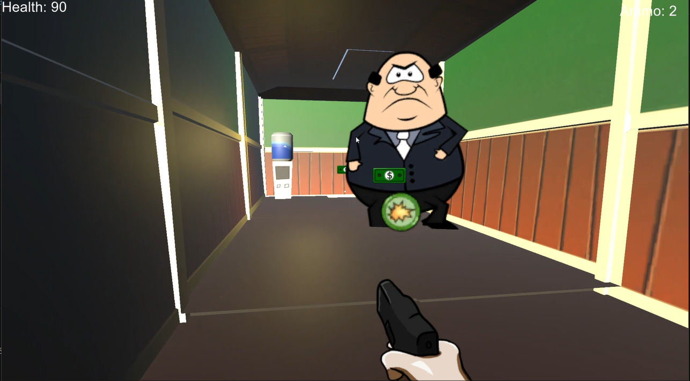
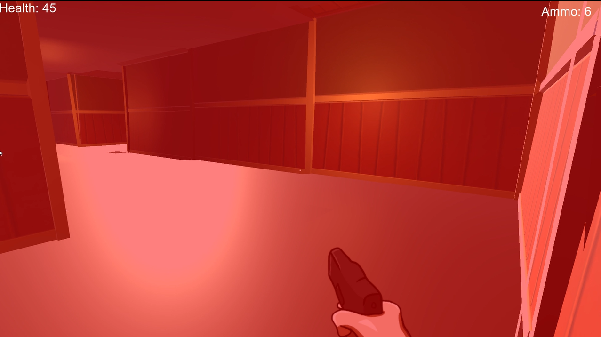

# 🔫 Crazy Mad Office Dude Game

## 🕹️ Description
**Crazy Mad Office Dude** is a fast-paced 3D action game where you take on the role of a furious office worker who has decided to fight back against the system — literally.  
Enemies are everywhere: annoying coworkers, micromanaging bosses, and malfunctioning office robots! Eliminate as many as you can and rack up your high score before getting overwhelmed.

Built with Unity, this game combines dynamic combat, hilarious animations, and arcade-style scoring into a chaotic office battleground.

---

## 🛠️ Features
- 🧍‍♂️ 3D third-person combat mechanics
- 💥 Melee and ranged attacks (keyboard smashing, mug throwing, etc.)
- 🧠 Enemy AI with different behaviors and attack patterns
- 🔢 Scoring system based on enemy kills and combos
- 💣 Power-ups and health pickups
- 🎮 Gamepad and keyboard support
- 🪙 High score tracking

---

## 🎮 How to Play

1. Launch the game.
2. Use **WASD / Arrow Keys** to move.
3. Use **Left Click** to attack / throw.
4. Defeat as many enemies as possible to increase your score.
5. Avoid taking damage and survive as long as possible.
6. Grab power-ups and health boosts to stay alive longer!

---

## 📸 Screenshots

<p align="center">
  
  
  
</p>

## 🎬 Gameplay Preview

[![Watch the video]](https://drive.google.com/file/d/1WQHAMEtOmpZ2dndNOZ0mumMZfP5ncA1k/view?usp=sharing)
---

## 📂 Project Structure

```plaintext
CrazyMadOfficeDude/
├── Assets/
│   ├── Scripts/               # Player controller, enemy AI, scoring, game manager
│   ├── Models/                # 3D character models, enemies, props
│   ├── Materials/             # Textures and materials
│   ├── Animations/            # Attack, idle, hit, death animations
│   ├── Audio/                 # Background music and sound effects
│   ├── Prefabs/               # Player, enemies, power-ups
│   └── Scenes/                # Main menu, gameplay level
├── ProjectSettings/
├── Packages/
└── README.md
